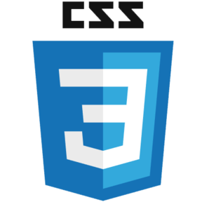
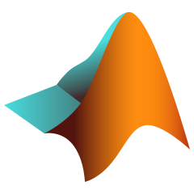
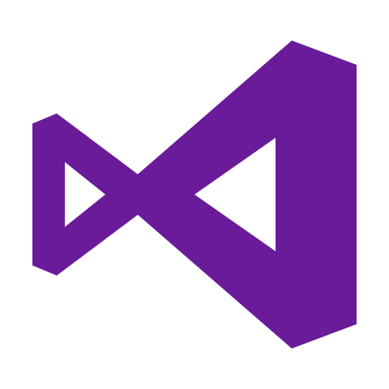

&nbsp;

---

### 🛰️ Latest work

> I just completed my Bachelor's thesis in Computer Science, building a **machine learning pipeline to detect and count avocado plants from satellite imagery** using infrared spectral bands (NIR & SWIR).  
> The system classifies images pixel-by-pixel via a **Random Forest**, then estimates plant counts through **linear regression** on pixel clusters — lightweight, interpretable, no deep learning needed.

📄 **[Check it out →](https://github.com/Tob1a/thesis)** *(Random Forest su immagini satellitari, Unife 2025–2026)*

---

### 🔨 What I'm working on

- 🐍 **Python** — ML pipelines, data analysis, scikit-learn
- ☕ **Java** — back-end and academic projects
- 📊 **R** — statistical analysis and data visualization
- 💬 Favourite line of code: &nbsp; `git commit -m "fix: finally"`

---

### 🚀 Top Technologies

---

### 🛠️ Also fluent in

  

---

📊 &nbsp;<b>GitHub Stats</b>
 

---

⛰️ &nbsp;*When not pushing code, I'm pushing myself up a mountain.*

